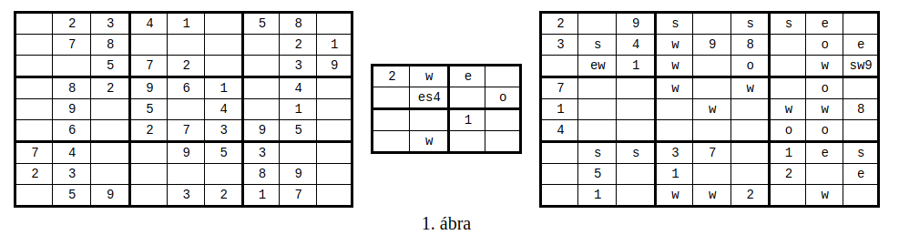
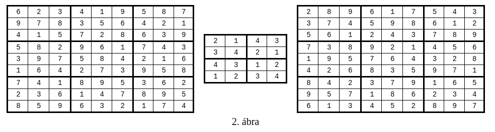

# Deklaratív programozás Prolog nagyházi - Sudoku-variáció: páratlan összegek

A megoldandó feladat a közismert Sudoku egy variánsa.

## Definíciók

**Sudoku-mátrixnak** hívunk egy olyan négyzetes mátrixot, amelyben a sorok (és az oszlopok) száma egy n = k<sup>2</sup> ≥ 1 négyzetszám. (Tehát a mátrix elemeinek száma n<sup>2</sup> = k<sup>4</sup>.)

Egy Sudoku-mátrixban **cellának** hívunk egy olyan (folytonos) részmátrixot, amely k sorból és k oszlopból áll, és bal felső sarkának sor- ill. oszlopsorszáma i*k+1 ill. j*k+1, ahol 0 ≤ i,j ≤ k-1 (a sorokat és oszlopokat 1-től számozzuk).

A Sudoku-mátrix elemeit **mezőknek** is nevezzük.

Egy **Sudoku-feladvány** egy olyan Sudoku-mátrix, amelynek egyes mezői segítő információkat (röviden infókat) tartalmaznak. A Sudoku játék közismert alapváltozatában csak ún. **száminfók** fordulnak elő, amelyek azt írják elő, hogy a megoldás adott mezője egy adott számot tartalmazzon.

Egy `n*n` méretű Sudoku-feladvány **helyes megoldása** egy olyan `n*n`-es Sudoku-mátrix, amelynek mezői 1 és n közé eső egész számok. A megoldás helyességének alapfeltétele, hogy annak minden sorában, oszlopában és cellájában különböző számok álljanak, tehát a mátrix minden ilyen részterülete az 1..n számok mindegyikét pontosan egyszer tartalmazza. Emellett a megoldás helyességéhez az is szükséges, hogy teljesítse az infók által előírt korlátozásokat. A feladvány egy (i,j) koordinátájú mezőjében levő M száminfó azt írja elő, hogy a megoldás azonos helyzetű, (i,j) koordinátájú mezője az M számot kell tartalmazza.

A jelen házi feladatban a száminfók mellett két további fajta segítő információ fordulhat elő. A **paritási** infó a megoldás adott mezőjének paritását adja meg, tehát előírja, hogy az páros vagy páratlan értékű legyen. A szomszédsági infó azt az információt hordozza, hogy az adott mezőben valamint egy megadott szomszédos mezőben levő értékek összege páratlan (vagyis paritásuk különbözik). A paritási és szomszédsági korlátozásokból egy mezőre több is vonatkozhat, ezek akár egymásnak vagy a száminfónak is ellentmondhatnak.

### Megjegyzések

  - Az újságokban vagy a világhálón publikált, "emberi fogyasztásra" szánt Sudoku-feladványok többnyire egyetlen megoldással bírnak. A jelen házi feladatban a megoldások számára nem teszünk semmilyen megszorítást, így a feladványoknak lehet 0, 1 vagy több megoldása is.
  - A szomszédsági infók halmaza általában nem teljes, azaz nem garantáljuk, hogy feladványban az összes teljesülő szomszédsági infó meg van adva. Azaz két szomszédos mező értékeinek összege akkor is lehet páratlan, ha nem vonatkozik rájuk szomszédsági infó. Másszóval, abból, hogy két mezőre nem vonatkozik szomszédsági infó, nem következik, hogy értékük összege páros.

## Példák

Példaként három Sudoku-feladványt mutatunk az 1. ábrán, ahol a k cellaméret rendre 3, 2, 3.

A legegyszerűbb esetben az infó egy szám: az adott mező előírt értéke. A további infókat egybetűs azonosítókkal jelezzük. A száminfótól különböző előírásokból többféle is lehet egy mezőben.

Három Sudoku-feladványt mutatunk az 1. ábrán, ahol rendre k = 3, 2, 3.



Az első feladványban csak száminfók vannak, mint a hagyományos Sudokuban. A második és harmadik feladványban betűk jelzik a paritási és szomszédsági infókat, ezek jelentése:

  - e (even): az adott mező értéke páros,
  - o (odd): az adott mező értéke páratlan,
  - s (south): az adott és az alatta levő mező értékének összege páratlan,
  - w (west): az adott és a tőle balra levő mező értékének összege páratlan.

Az e és o betűk **paritási infó**kat, míg az s és w betűk **szomszédsági infó**kat adnak meg.

A Sudoku-feladvány bal szélső oszlopának mezőiben nem állhat w, alsó sorának mezőiben pedig s, mivel ezek az infók nem létező mezőkre vonatkoznának.

Egy mezőben az ötféle infó (a száminfó ill. a négyféle, betűkkel jelzett infók) mindegyike legfeljebb egyszer szerepelhet. Megengedett, hogy ezek az infók ellentmondjanak egymásnak (pl. egy páratlan értéket jelző o infó mellett állhat egy páros szám száminfóként) – ilyen esetben természetesen a feladványnak nincs megoldása.

Az 1. ábrán látható három feladvány egy-egy megoldását a 2. ábra mutatja. Az első feladványnak van más megoldása is, a másik kettőnek az ábrán szereplő tábla az egyetlen megoldása.



## A megoldandó programozási feladat

Írjon sudoku néven olyan Prolog-eljárást, amely egy feladvány összes megoldását előállítja! Feltételezheti, hogy a feladvány cellamérete legfeljebb 10.

A Prolog-eljárásnak két paramétere van. Első (bemenő) paramétere a feladványt, második (kimenő) paramétere a megoldást írja le. Az eljárásnak a visszalépések során minden megoldást pontosan egyszer kell kiadnia (tetszőleges sorrendben). Ez azt is jelenti, hogy ha a feladványnak nincs megoldása, az eljárásnak meg kell hiúsulnia.

A Prolog-eljárás bemenő paramétere egy

```prolog
    s(K,F)
```
felépítésű struktúra, ahol

  - K a cellák oldalhossza,
  - F a sorok listájaként megadott feladvány, ahol egy sor a benne levő mezők listája.

A feladvány egy mezőjét infók listájaként adjuk meg. Infó lehet az e, o, s és w atom, továbbá a v(N) struktúra, ahol N az adott mező előírt értéke (a v rövidítés az angol value szóból származik). Az infók listájában mindegyik atom illetve struktúra legfeljebb egyszer, de tetszőleges sorrendben fordulhat elő, és a lista üres is lehet.

A Prolog-eljárás kimenő paramétere a feladvány egy megoldása, amelyet számokat tartalmazó listák listájaként ábrázolunk.

Például az 1. ábra középső feladványát a következő Prolog-struktúrával írjuk le:

```prolog
       s(2, [[[v(2)],         [w],         [e],          []],
             [    [],  [e,s,v(4)],          [],         [o]],
             [    [],          [],      [v(1)],          []],
             [    [],         [w],          [],          []]])
             ```
A feladvány egyetlen megoldását a következő lista írja le:

```prolog
        [[ 2, 1, 4, 3],
         [ 3, 4, 2, 1],
         [ 4, 3, 1, 2],
         [ 1, 2, 3, 4]]

```

## A megírandó függvény, ill. eljárás specifikációja

A sudoku/2 Prolog-eljárás típusát a következő - megjegyzésként megadott - Prolog-típusdefiníciók írják le.

```prolog
% :- type sspec ---> s(size, board).
% :- type size  == int.
% :- type field == list(info).
% :- type info ---> e; o; s; w; v(int).
% :- type board == list(list(field)).

% :- type ssol == list(list(int)).

% sudoku(SSpec, SSol):
% SSol az SSpec feladványt kielégítő megoldás.
% :- pred sudoku(sspec::in, ssol::out).
```
A házi feladat megoldása során a feladványra vonatkozó, fent ismertetett formai előírások meglétét nem kell ellenőriznie. Feltételezheti, hogy

  - a sudoku eljárás, ill. függvény első paraméterében a fenti típusdefinícióknak megfelelő feladvány-adatstruktúrát kap;
  - a megadott k cellamérettel összhangban a feladványban megadott mátrixnak k sora és k oszlopa van;
  - a száminfókban szereplő egész értékek az 1..k*k tartományba esnek.

## Keretprogramok

Programjait keretprogramok segítségével próbálhatja ki. A keretprogram bemenete egy olyan szövegfájl, amelynek első nem üres sora a Sudoku-feladvány cellaméretét, minden egyes további nem üres sora a Sudoku-feladvány egy-egy sorát tartalmazza, ahol az egyes mezők értékét egy vagy több szóköz választja el. A - karakter jelzi, ha egy mező nem tartalmaz infót. Ha tartalmaz, a mezőt az infók felsorolásával adjuk meg: a számot decimális alakban, a többi infót a betűjelével írjuk le; a jelek közé nem szabad szóközt tenni.

Például az 1. ábra közepső Sudoku-feladványát a 3. ábrán látható módon ábrázoljuk a bemeneti szövegfájlban:

```
3. ábra:

2
2   w   e   -
-   es4 -   o
-   -   1   -
-   w   -   -
```


A keretprogram kimenete a 4. ábrán bemutatotthoz hasonló tartalmú szövegfájl.

```
4. ábra:
-----

2  1  4  3
3  4  2  1
4  3  1  2
1  2  3  4

-----
```

### A Prolog-keretprogram

A `ksudoku.pl` Prolog-keretprogram a következő eljárásokat exportálja:

```
% :- pred sudoku_be(file::in, sspec::out).
```
A megnevezett szövegfájlból beolvassa a feladványt, és visszaadja a kimenő paraméterben.

```
% :- pred sudoku_ki(file::in, ssol::in).
```
  A megnevezett szövegfájlba kiírja a feladvány második paraméterként átadott összes megoldását.

```
% :- pred megold(file::in, file::in).
```
  Beolvas egy feladványt az első paraméterrel megnevezett szövegfájlból, és kiírja az összes megoldását a második paraméterrel megnevezett szövegfájlba. Ehhez felhasználja a sudoku/2 eljárást.

```
% :- pred stopper(file::in, file::in).
```
  Mint `megold/2`, de a végén kiírja a feladvány nevét, a megoldások számát és a futási időt is.

```
% :- pred teljes_teszt(int::in).
```
  A tests könyvtárban levő összes testXXXd.txt tesztállomány esetén:
  - lefuttatja a tesztet az első paraméterben megadott, másodpercben értelmezett időkorláttal,
  - ellenőrzi, hogy a testXXXs.txt állományban megadott megoldáshalmazt kapta,
  - olvasható formában (lásd `megold/2`) kiírja az eredményt a tests_out könyvtár testXXXt.txt nevű állományába.

A fenti állománynevekben XXX egy tetszőleges hosszúságú számjegysorozatot jelöl.

Ezt az eljárást Eisenberger András ültette át Prologra.

A keretprogram felhasználja a file típust:

```
% :- type file == atom.
```
A file típusú paraméterben a user atomot megadva a terminálról vihetünk be, ill. a terminálra írathatunk ki adatokat. Egyébként a megadott nevű fájlba írunk, ill. fájlból olvasunk.


**Használat**: saját programját a **sudoku.pl** nevű fájlba tegye, különben a ksudoku.pl keretprogram nem találja meg. Ezután futtassa a SICStus interpretert, és töltse be a keretprogramot.

#### Példa:

```
SICStus 4.2.3 (x86-linux-glibc2.5): Fri Oct  5 15:56:32 CEST 2012
Licensed to BUTE DP Course
| ?- [ksudoku].
% compiling /home/szeredi/tmp/ksudoku.pl...
%  module sudoku_keret imported into user
(...)
% compiled /home/szeredi/tmp/ksudoku.pl in module sudoku_keret, 30 msec 78104 bytes
yes
| ?- stopper('teszt0.txt','teszt0.sol').
```

A `stopper/2`, ill. `megold/2` eljárások meghívása a sudoku.pl programot automatikusan betölti (ha szükséges), ezért ennek módosításakor nem kell sem a SICStus interpretert újraindítania, sem a keretprogramot újra betöltenie.
